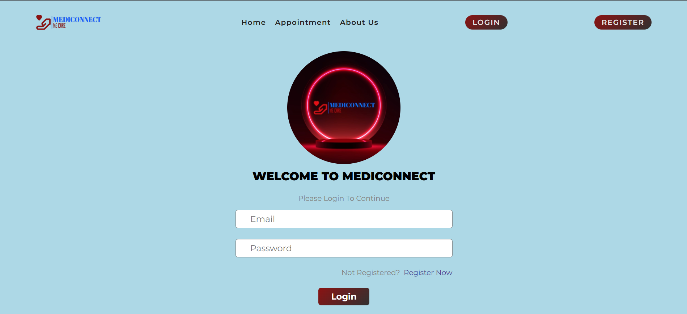
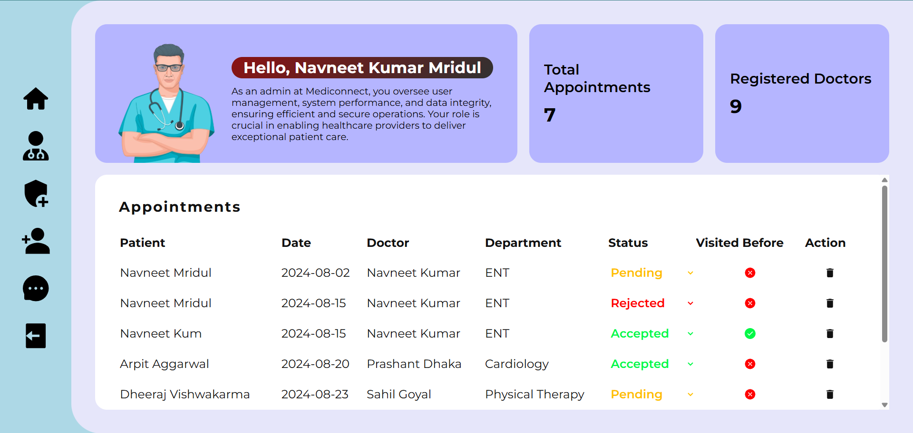

# MediConnect 🏥

A full-stack **Hospital Management System** built with the **MERN Stack** (MongoDB, Express.js, React, Node.js), featuring:
- ✅ Secure JWT-based authentication
- 👩‍⚕️ Dual frontends for patients and admins
- 🚀 Scalable architecture
- 🌐 Live Demo: [Visit MediConnect](https://medi-connect-nzt2.vercel.app)

---

## 📸 Screenshots
| Patient Dashboard | Admin Panel |
|------------------|-------------|
|  |  |

---

## 🚀 Features
- 🔐 User login & registration (JWT-based)
- 📋 Appointment booking
- 👨‍⚕️ Doctor and patient management
- 📊 Admin dashboard analytics

---

## 🛠️ Tech Stack
- **Frontend:** HTML, CSS, JavaScript, React
- **Backend:** Node.js, Express.js
- **Database:** MongoDB
- **Deployment:** Vercel & Render

---
